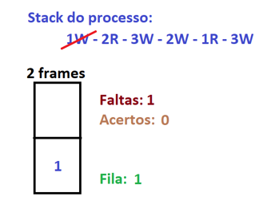
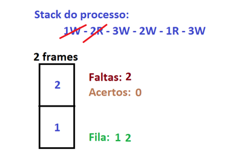
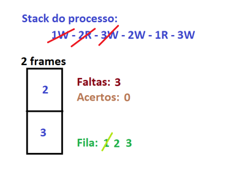
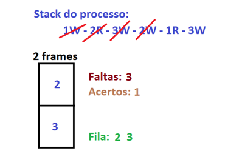
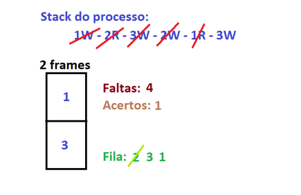
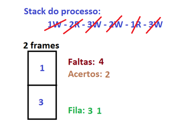

# Substituicao-Paginas
> Aplicação Java que simula a operação dos algoritmos de substituição de páginas e gera gráficos e tabela com valores de acertos.
---

## Explicação Básica sobre os Algoritmos

### 1) First-In, First-Out (FIFO)

Como próprio nome sugere, simula uma fila, onde: quando ocorrer uma falta de página, a página que está a mais tempo na fila será removida e então a página atualmente referenciada será adicionada ao final da fila.

Considere a seguinte Stacktrace do processo:

```
                    1W - 2R - 3W - 2W - 1R - 3W
```

Aplicando o FIFO, obteremos:

1. **Página 1 foi referenciada**:

    Como a página 1 não está presente em nenhum frame, será considerada como falta. Então, adicionaremos a mesma na fila e em um frame também:

    

2. **Página 2 foi referenciada**:
     
    Como a página 2 também não está presente em nenhum frame, será considerada como uma segunda falta. Então, adicionaremos a mesma na fila e também no frame livre:
    
    

3. **Página 3 foi referenciada**:

    Como a página 3 também não está presente em nenhum frame, será considerada como um falta. Entretanto, observe que já estamos com os frames todos ocupados. O que vai acontecer nesse caso é a aplicação da FIFO: vamos tirar da fila e do frame o que está a mais tempo(no caso a página 1) e vamos adicionar em seu local no frame a página 3, bem como adicionar a página 3 ao fim da fila:

    

4. **Página 2 foi referenciada**:

    Observe que a página 2 já está presente em um frame. Nesse caso, temos um acerto. Não precisamos nem mexer na fila e nem no frame.

    

5. **Página 1 foi referenciada**:

    Como a página 1 não está presente em algum frame, precisaremos aplicar a FIFO: iremos tirar a que está a mais tempo na fila, no caso a página 2, tanto da fila quanto do frame e, no seu local no frame, colocaremos a página 1:

    

6. **Página 3 foi referenciada**:

    Como a página 3 já está em um frame não precisaremos fazer nada além de aumentar a quantia de acertos para 2:

    

<br/>
### 2) Menos Recente Usada (MRU)

### 3) Segunda Chance(SC)

### 4) Não Usada Recentemente(NUR)

## Exemplos de Uso
